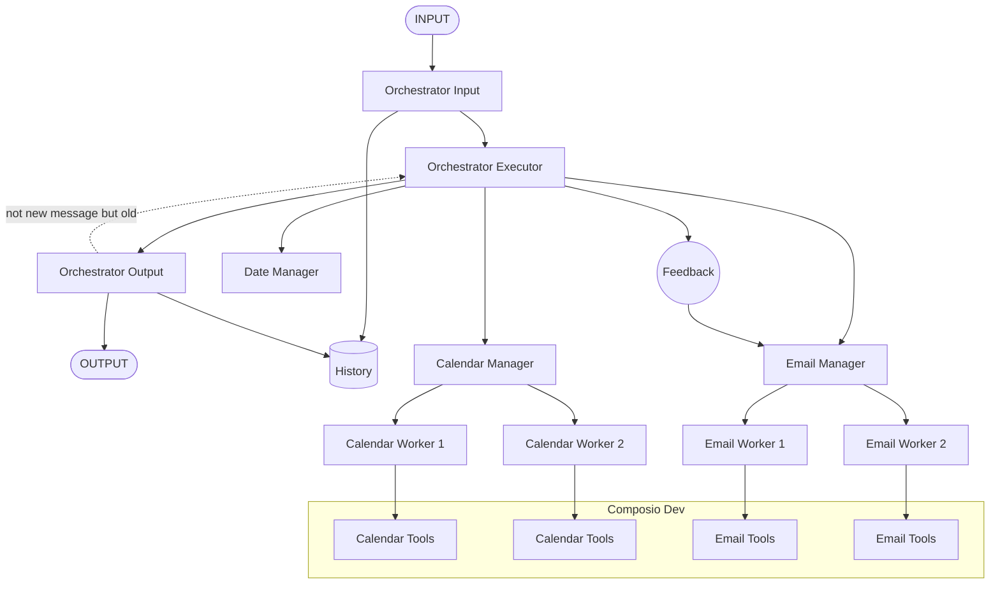

# Alloy Agent
AI multi-agent system for Work/Personal Gmail & Google Calendar management deployed as a Discord bot.

<p align="center">
  
</p>


## What It Does?

- Manages both work and personal accounts in one place.
- Handles emails: drafts, replies, searches, summaries.
- Handles calendars: schedules, updates, deletes, conflict checks.
-Understands natural language:
  *  “Schedule a call with John next Friday at 3 PM.”
- Runs entirely inside Discord chat → no app switching.
--- 
## The Brain: GPT-5 
*Integration through [AI/ML API](https://aimlapi.com/)*

At the heart of Alloy Agent is **GPT-5**, acting as the **orchestration brain**:

- **Understands context** → Interprets natural language like *“Move my client call to after lunch.”*
- **Decomposes tasks** → Breaks requests into structured subtasks.
- **Coordinates agents** → Assigns subtasks to specialized managers for emails, calendars, and accounts.
- **Learns patterns** → Adapts to personal + work styles over time.
--- 
## How It Works?

* User sends a request in Discord.
* GPT-5 Orchestrator Agent breaks it into smaller tasks.
* Specialized Managers handle each task:
   * Date Manager → parses “tomorrow at 5 PM” or “last week of this month.”
   * Email Manager → drafts/replies/searches Gmail.
   * Calendar Manager → creates/updates Google Calendar events.

* Workers (stateless ReAct agents) execute actions via Composio tools.
* Orchestrator combines results → sends a clear, final response back in Discord.
  
#### *High-Level Flow* 



## How to Setup
Don't worry, the following steps will guide you to make it your own.  
You will configure three main components:  

* **Composio** → for account connection and tool orchestration  
* **PostgreSQL** → for persistent storage (optional, falls back to SQLite)  
* **Discord Bot** → user interaction interface  

  

### 1. Composio Setup

1. Log in to [Composio](https://composio.dev/) and retrieve your API key from **Settings** (it's free).
2. Add the API key to your `.env` file:

   ```env
   COMPOSIO_API_KEY=your_api_key_here
   ```

3. Create an entity in the Composio dashboard. By default, it is `"default"`. Update `.env` accordingly:

   ```env
   COMPOSIO_ENTITY_ID=default
   ENTITY_ID_WORK_ACCOUNT=work # optional
   ENTITY_ID_PERSONAL_ACCOUNT=personal  
   ```

4. Update Composio to the latest version and add tools to your entities:

   ```bash
   pip install -U composio
   composio add <tool> -e <entity>
   ```

   Example for Google Calendar:

   ```bash
   composio add googlecalendar -e personal
   ```

5. Complete account authorization and verify active tools in the dashboard:

   ```
   Dashboard → Entity → Auth Configs Section → Active Tools
   ```

---

### 2. Setting Environment Variables

Create a `.env` file in your project root and configure required keys.

```env
# OPENAI API Key
OPENAI_API_KEY=your_api_key_here

# Discord Bot Token
DISCORD_BOT_TOKEN=your_discord_bot_token_here
```

For other APIs, update the relevant LLM scripts accordingly.

---

### 3. PostgreSQL Setup

1. Download and install PostgreSQL (optional).  
   If PostgreSQL is not available, the system automatically falls back to **SQLite**.  

2. If using PostgreSQL, create a database and add the URI to your `.env` file:

   ```env
   POSTGRES_DB_URI=postgresql://user:<password>@<host>:<port>/<dbname>
   ```

---

### 4. Discord Bot Setup

#### 1. Create a Discord Application
1. Go to the [Discord Developer Portal](https://discord.com/developers/applications).
2. Click **New Application** and give it a name.
3. In the left menu, click **Bot** → **Add Bot**.

#### 2. Get the Bot Token
1. In the **Bot** tab, under **Token**, click **Reset Token** → **Copy**.
2. Add the token to your `.env` file:

   ```env
   DISCORD_BOT_TOKEN=your_token_here
   ```

#### 3. Enable Required Intents
In the **Bot settings** (Discord Developer Portal):

* Scroll to **Privileged Gateway Intents**.  
* Enable:  
  * **MESSAGE CONTENT INTENT** (required to read messages)  
  * (Optional) **SERVER MEMBERS INTENT** and **PRESENCE INTENT**  

#### 4. Invite the Bot to Your Server
1. Go to **OAuth2 → URL Generator** in the left menu.
2. Under **Scopes**, select:
   * `bot`
3. Under **Bot Permissions**, select at least:
   * **Read Messages / View Channels**  
   * **Send Messages**  
   * **Read Message History**  
4. Copy the generated URL, paste it in your browser, and invite the bot to your server.

---

### 5. Running the Project

You can either run locally or use Docker.

#### Local 
1. Using Pip
```bash
pip install -r requirements.txt
python -m agent_workflow.discord_bot
```
2. Using Poetry
```bash
poetry install
poetry shell
poetry run python -m agent_workflow.discord_bot
```  
#### Docker Run
Build and run with Docker Compose:

```bash
docker compose up --build
```

---

### 6. Quick Test

Once the bot is running and invited to your server, send a message in Discord such as:

```
Schedule a meeting with Sergey  tomorrow at 3 PM
```
The bot should parse the date, check availability in Google Calendar, and return a confirmation message.

Example:


---
